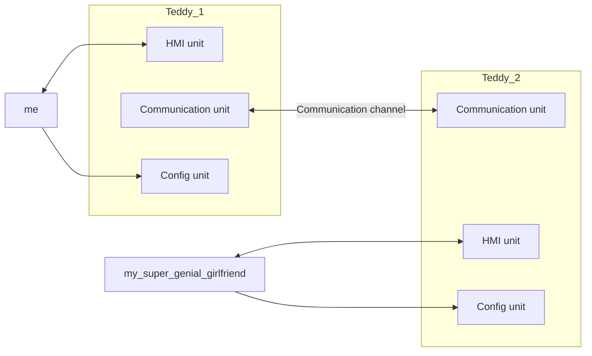

# Love has no limits

The goal of this project is to create a teddy to your partner, or any people you love !!

## How I think it
- Firstly, pair teddies
- Press a button to light on the paired teddy

Globally, that's what I see :

## What are my wanted functionnalities
- Light configuration (color, power, sequence)
- Teddies quality (so sweet to cuddle)
- Security in communications

## How I implement it
I will create different configurations, and choose one of them. The important thing to keep in mind is the technical order of the differents units. In my mind; it looks like :
- Communication unit
- HMI unit
- Config unit
I've choose this one because configuration depends on communication (for example to configure channel parameters) and hmi (for example to configure lights colors).

### Communication unit
- By WIFI
- By Lora networks
- By magical things done by an hybrid of Gandalf, Harry Potter and Obi-Wan

### HMI unit
- Hmmm, we will answer this one when other ones are done

### Config unit
- By USB formatted filesystem 
- By USB as serial channel
- By serial
- By web interface
- By bluetooth
