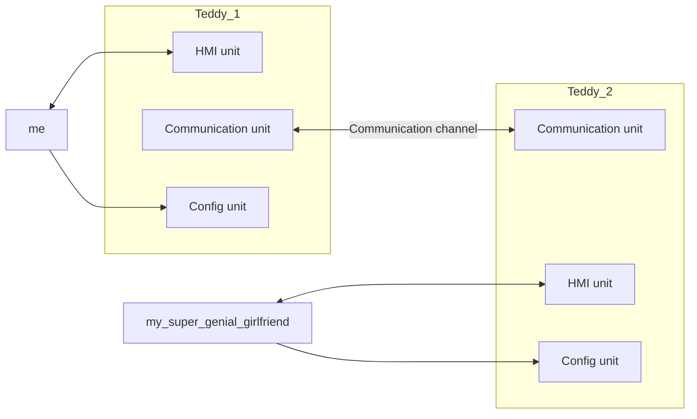

# Love has no limits

The goal of this project is to create a teddy to your partner, or any people you love !!

## How I think it
- Firstly, pair teddies
- Press a button to light on the paired teddy

Globally, that's what I see :

## How I implement it
I will create different configurations, and choose one of them.

### Config unit
- By USB formatted filesystem 
- By USB as serial channel
- By serial
- By web interface
- By bluetooth
